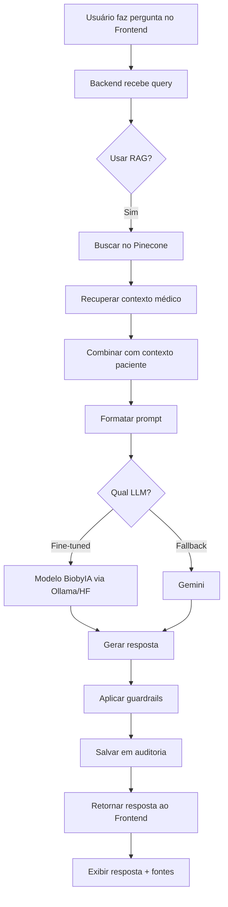

# Planejamento Completo - Medical Assistant

## 📊 Análise Geral do Projeto

O projeto é um **Assistente Virtual Médico** composto por:

1. **Backend (Node.js/Express)**: API REST com LangChain, MongoDB, Pinecone
2. **Frontend (Vue.js)**: Interface web para chat médico
3. **Fine-Tuning Pipeline (Python)**: Preparação e treinamento de modelo LLM médico
4. **RAG Pipeline (Python)**: Ingestão de dados médicos no Pinecone para busca semântica

### Estado Atual
- ✅ Backend estruturado com suporte a múltiplos providers (Gemini, Ollama, BiobyIA)
- ✅ Frontend Vue.js funcional
- ✅ Pipeline de fine-tuning completo (pré-processamento + treinamento)
- ✅ Pipeline RAG com scripts modulares
- ⚠️ Modelo fine-tunado ainda não foi treinado
- ⚠️ RAG ainda não foi executado (dados não estão no Pinecone)
- ⚠️ Integração entre fine-tuned model e backend não está completa
- ⚠️ Integração RAG com backend parcial (só para pacientes, não para protocolos médicos)

---

## ⚠️ CONSIDERAÇÕES IMPORTANTES SOBRE HARDWARE

### Configuração Atual do Sistema
- **CPU**: Intel Core i7-8665U (8 cores)
- **RAM**: 16 GB
- **GPU**: Intel UHD Graphics 620 (integrada, sem CUDA)
- **Sistema**: Manjaro Linux

### Limitações para Fine-Tuning

**❌ Problema**: Fine-tuning de modelos LLM requer GPU dedicada com CUDA (mínimo 8GB VRAM recomendado). O sistema atual não possui GPU dedicada.

### Alternativas para Fine-Tuning

#### Opção 1: Google Colab Pro (RECOMENDADO)
- **Vantagens**: 
  - GPU gratuita (T4) ou paga (V100/A100)
  - Ambiente pré-configurado
  - Fácil compartilhamento de notebooks
- **Custo**: Gratuito (com limitações) ou ~$10/mês (Colab Pro)
- **Passos**:
  1. Upload do código para Google Drive ou GitHub
  2. Abrir notebook no Colab
  3. Instalar dependências
  4. Executar fine-tuning
  5. Download do modelo treinado

#### Opção 2: Kaggle Notebooks
- **Vantagens**: 
  - GPU gratuita (P100) por 30h/semana
  - Ambiente similar ao Colab
- **Limitações**: Tempo limitado de GPU
- **Passos**: Similar ao Colab

#### Opção 3: Fine-Tuning em CPU (NÃO RECOMENDADO)
- **Possível mas muito lento**: Pode levar dias ou semanas
- **Modelos menores**: Usar modelos muito pequenos (ex: Phi-3-mini)
- **LoRA com rank baixo**: Reduzir parâmetros treináveis
- **Tempo estimado**: 3-7 dias para dataset pequeno

#### Opção 4: Serviços Cloud (AWS, GCP, Azure)
- **Vantagens**: Controle total, múltiplas opções de GPU
- **Custo**: ~$0.50-2.00/hora para instâncias com GPU
- **Recomendado**: AWS EC2 (g4dn.xlarge) ou Google Cloud (n1-standard-4 + GPU)

#### Opção 5: Usar Modelo Pré-Treinado (ALTERNATIVA)
- **Vantagem**: Não precisa treinar
- **Opções**:
  - Usar modelo médico já fine-tunado do Hugging Face
  - Usar modelo base com RAG robusto (pode compensar falta de fine-tuning)

### Recomendação para Este Projeto

**Estratégia Híbrida**:
1. **Curto prazo**: Executar fine-tuning no Google Colab Pro
2. **Upload para Hugging Face**: Publicar modelo treinado
3. **Consumo**: Usar Hugging Face Inference API ou Ollama local (para inferência, CPU é suficiente)

---

## 🎯 Fase 1: Fine-Tuning do Modelo (PRIORIDADE 1)

### Objetivo
Treinar um modelo LLM especializado em medicina usando o dataset PubMedQA.

### Pré-requisitos
- ⚠️ **GPU com CUDA** (8GB+ VRAM) - **NÃO DISPONÍVEL NO SISTEMA ATUAL**
- **Alternativa**: Google Colab Pro ou serviço cloud
- Python 3.8+

### Passos Detalhados

#### 1.1 Preparar Ambiente Local (Pré-processamento)
```bash
cd fine_tuning
pip install -r requirements.txt  # Criar requirements.txt se não existir
```

**Dependências necessárias para pré-processamento:**
- `json`
- `pathlib`
- `re`
- `python-dotenv`

**Nota**: Pré-processamento pode ser feito localmente (não precisa GPU).

#### 1.2 Executar Pipeline de Pré-processamento (LOCAL)
```bash
# Executa: pré-processamento + validação + formatação Alpaca
python run_pipeline.py --all
```

**Arquivos gerados:**
- `medical_tuning_data.json` (dados processados)
- `formatted_medical_dataset.json` (formato Alpaca)

**Verificação:**
- Validar que os arquivos foram criados
- Verificar estatísticas de validação

#### 1.3 Preparar para Fine-Tuning no Colab

**Opção A: Adaptar Notebook para Colab**

1. Criar versão do notebook para Colab:
   - Upload de `formatted_medical_dataset.json` para Google Drive
   - Adaptar caminhos no notebook
   - Instalar dependências no Colab

2. Passos no Colab:
```python
# Célula 1: Instalar dependências
!pip install 'unsloth[colab-new] @ git+https://github.com/unslothai/unsloth.git'
!pip install --no-deps xformers "trl<0.9.0" peft accelerate bitsandbytes
!pip install transformers datasets

# Célula 2: Montar Google Drive (se dataset estiver lá)
from google.colab import drive
drive.mount('/content/drive')

# Célula 3: Carregar dataset
import json
with open('/content/drive/MyDrive/formatted_medical_dataset.json', 'r') as f:
    dataset = json.load(f)

# Célula 4: Executar fine-tuning (usar código do notebook existente)
```

**Opção B: Script Python Adaptado**

Criar `fine_tuning/training/finetuning_colab.py` que:
- Detecta se está rodando no Colab
- Ajusta caminhos automaticamente
- Faz upload do modelo para Google Drive ao final

#### 1.4 Executar Fine-Tuning (NO COLAB)

**Configurações importantes** (`training/model_config.py`):
- Modelo base: `unsloth/llama-3-8b-bnb-4bit` (padrão)
- LoRA rank: 16
- Learning rate: 2e-4
- Max steps: 100 (ajustar conforme dataset)

**Tempo estimado no Colab (T4)**: 2-4 horas

#### 1.5 Download do Modelo Treinado

Após fine-tuning no Colab:
```python
# No Colab, após treinamento
from google.colab import files
import shutil

# Compactar modelo
shutil.make_archive('lora_model_medical', 'zip', 'outputs/lora_model_medical')

# Download
files.download('lora_model_medical.zip')
```

Ou fazer upload direto para Hugging Face (ver Fase 2).

#### 1.6 Validar Modelo Treinado (LOCAL)
```bash
# Após download do Colab
cd fine_tuning
unzip lora_model_medical.zip -d outputs/
python inference/test_model.py --model_path outputs/lora_model_medical --mode examples
```

**Nota**: Inferência pode ser feita em CPU (mais lenta, mas funcional).

---

## 🚀 Fase 2: Publicar Modelo no Hugging Face

### Objetivo
Tornar o modelo acessível via Hugging Face para uso em produção.

### Passos Detalhados

#### 2.1 Preparar Modelo para Upload
**Opção A: Upload de Adaptadores LoRA (Recomendado)**
- Upload apenas dos adaptadores LoRA (menor tamanho)
- Requer modelo base disponível no Hugging Face

**Opção B: Merge e Upload Completo**
- Fazer merge dos adaptadores com modelo base
- Upload do modelo completo (maior tamanho)

#### 2.2 Criar Conta e Repositório no Hugging Face
1. Criar conta em https://huggingface.co
2. Criar novo repositório (ex: `seu-usuario/biobyia-medical-lora`)
3. Obter token de acesso (Settings → Access Tokens)

#### 2.3 Instalar e Configurar Hugging Face CLI
```bash
pip install huggingface_hub
huggingface-cli login
```

#### 2.4 Script de Upload
Criar script `fine_tuning/upload_to_hf.py`:

```python
from huggingface_hub import HfApi, login
from pathlib import Path

# Login
login(token="seu_token_aqui")

# Upload
api = HfApi()
model_path = Path("outputs/lora_model_medical")
repo_id = "seu-usuario/biobyia-medical-lora"

api.upload_folder(
    folder_path=str(model_path),
    repo_id=repo_id,
    repo_type="model"
)
```

#### 2.5 Consumir Modelo via Hugging Face Inference API
**Opção 1: Usar Inference API (gratuito para modelos públicos)**
```python
import requests

API_URL = "https://api-inference.huggingface.co/models/seu-usuario/biobyia-medical-lora"
headers = {"Authorization": f"Bearer {HF_TOKEN}"}

def query_model(prompt):
    response = requests.post(API_URL, headers=headers, json={"inputs": prompt})
    return response.json()
```

**Opção 2: Baixar e usar localmente via Ollama**
- Converter modelo para formato Ollama
- Servir via Ollama localmente
- Backend consome via API Ollama

---

## 🔍 Fase 3: Executar Pipeline RAG

### Objetivo
Ingerir dados médicos do PubMedQA no Pinecone para busca semântica.

### Pré-requisitos
- Conta Pinecone (https://app.pinecone.io)
- API Key do Gemini (para embeddings) ou Ollama rodando
- Dataset `ori_pqal.json` no caminho correto

### Passos Detalhados

#### 3.1 Configurar Variáveis de Ambiente
Criar `rag_medical/.env`:
```env
PINECONE_API_KEY=sua_chave_aqui
PINECONE_INDEX_NAME=biobyia
PINECONE_NAMESPACE=medical_qa

GEMINI_API_KEY=sua_chave_gemini
EMBEDDING_MODEL=text-embedding-004

MEDICAL_DATA_PATH=../context/pubmedqa-master/data/ori_pqal.json
CHUNK_SIZE=512
CHUNK_OVERLAP=50
```

#### 3.2 Instalar Dependências
```bash
cd rag_medical
pip install -r requirements.txt
```

#### 3.3 Executar Pipeline (Notebooks)
Execute na ordem:

1. **01-load-and-explore-data.ipynb**
   - Carrega e explora dataset
   - Valida estrutura

2. **02-process-medical-data.ipynb**
   - Processa e anonimiza dados
   - Divide em chunks

3. **03-embed-and-ingest-pinecone.ipynb**
   - Gera embeddings
   - Ingesta no Pinecone
   - ⚠️ **Pode levar 20-30 minutos**

4. **04-test-rag-query.ipynb**
   - Testa queries RAG
   - Valida recuperação

#### 3.4 Verificar Ingestão
```python
from scripts.rag_query import query_medical_rag

results = query_medical_rag("Do mitochondria play a role?", top_k=5)
print(f"Encontrados {len(results)} resultados")
```

---

## 🔗 Fase 4: Integração Backend + RAG + Modelo Fine-Tunado

### Objetivo
Integrar RAG e modelo fine-tunado ao backend para uso no chat médico.

### Arquivos Principais a Modificar

#### 4.1 Criar Serviço RAG no Backend
**Arquivo:** `backend/src/services/ragService.js`

**Funcionalidades:**
- Buscar contexto médico no Pinecone
- Formatar contexto para LLM
- Integrar com `medicalAssistantChain`

#### 4.2 Integrar RAG no MedicalAssistantChain
**Arquivo:** `backend/src/langchain/chains/medicalAssistantChain.js`

**Modificações:**
- Adicionar busca RAG para protocolos médicos (não apenas pacientes)
- Combinar contexto RAG com contexto do paciente
- Usar modelo fine-tunado quando disponível

**Fluxo:**
```
Query → RAG (Pinecone) → Contexto Médico → LLM (Fine-tuned) → Resposta
```

#### 4.3 Adicionar Provider Hugging Face
**Arquivo:** `backend/src/providers/HuggingFaceProvider.js` (novo)

**Opções de implementação:**

**Opção A: Inference API**
```javascript
const axios = require('axios');

class HuggingFaceProvider extends BaseProvider {
  async generate(prompt, options = {}) {
    const response = await axios.post(
      `https://api-inference.huggingface.co/models/${this.config.modelId}`,
      { inputs: prompt },
      { headers: { Authorization: `Bearer ${this.config.apiKey}` } }
    );
    return response.data[0].generated_text;
  }
}
```

**Opção B: Via Ollama (Recomendado)**
- Modelo fine-tunado servido via Ollama
- Backend usa provider Ollama existente
- Configurar `BIOBYIA_MODEL` no `.env`

#### 4.4 Atualizar Configuração LLM
**Arquivo:** `backend/src/config/llmConfig.js`

Adicionar suporte a Hugging Face:
```javascript
if (process.env.HUGGINGFACE_API_KEY) {
  providers.huggingface = {
    type: 'huggingface',
    name: 'Hugging Face',
    apiKey: process.env.HUGGINGFACE_API_KEY,
    modelId: process.env.HUGGINGFACE_MODEL_ID || 'seu-usuario/biobyia-medical-lora'
  };
}
```

#### 4.5 Integrar RAG no Prompt Médico
**Arquivo:** `backend/src/langchain/prompts/medical/medicalPrompts.js`

Modificar prompt para incluir contexto RAG:
```javascript
CONTEXTO DE PROTOCOLOS MÉDICOS (RAG):
{rag_context}

CONTEXTO DO PACIENTE:
{patient_context}
```

#### 4.6 Criar Endpoint para Teste
**Arquivo:** `backend/src/routes/medicalAssistantRoutes.js`

Adicionar endpoint de teste:
```javascript
router.post('/test-rag', async (req, res) => {
  // Testa RAG + modelo fine-tunado
});
```

---

## 💬 Fase 5: Integração Frontend + Chat

### Objetivo
Conectar frontend ao backend com RAG e modelo fine-tunado.

### Passos Detalhados

#### 5.1 Atualizar Configuração API
**Arquivo:** `frontend/src/config/api.js`

Verificar se está apontando para backend correto:
```javascript
const API_BASE_URL = import.meta.env.VITE_API_BASE_URL || 'http://localhost:4000';
```

#### 5.2 Atualizar ChatInterface
**Arquivo:** `frontend/src/components/ChatInterface.vue`

**Melhorias:**
- Mostrar fontes RAG na resposta
- Indicar quando usa modelo fine-tunado
- Exibir contexto recuperado (opcional, para debug)

#### 5.3 Adicionar Seletor de Provider
**Arquivo:** `frontend/src/components/ChatInterface.vue` (novo componente)

Permitir escolher entre:
- Gemini (padrão)
- Modelo Fine-Tunado (BiobyIA)
- Ollama

---

## 📋 Checklist de Execução

### Fase 1: Fine-Tuning
- [ ] Preparar ambiente local (pré-processamento)
- [ ] Executar `run_pipeline.py --all` (local)
- [ ] Validar dados processados
- [ ] Preparar notebook/script para Colab
- [ ] Executar fine-tuning no Colab
- [ ] Download do modelo treinado
- [ ] Validar modelo treinado com `test_model.py` (local, CPU)

### Fase 2: Hugging Face
- [ ] Criar conta e repositório no Hugging Face
- [ ] Criar script de upload
- [ ] Fazer upload do modelo
- [ ] Testar Inference API
- [ ] Decidir: Inference API ou Ollama local?

### Fase 3: RAG Pipeline
- [ ] Configurar `.env` do RAG
- [ ] Instalar dependências
- [ ] Executar notebooks 01-04
- [ ] Validar ingestão no Pinecone
- [ ] Testar queries RAG

### Fase 4: Integração Backend
- [ ] Criar `ragService.js`
- [ ] Modificar `medicalAssistantChain.js` para usar RAG
- [ ] Adicionar provider Hugging Face (ou configurar Ollama)
- [ ] Atualizar prompts médicos
- [ ] Testar endpoint `/api/medical/query` com RAG

### Fase 5: Integração Frontend
- [ ] Verificar configuração API
- [ ] Atualizar ChatInterface para mostrar fontes
- [ ] Adicionar seletor de provider (opcional)
- [ ] Testar chat completo end-to-end

---

## 🔧 Configurações Necessárias

### Backend `.env`
```env
# LLM
LLM_PROVIDER=biobyia  # ou huggingface
GEMINI_API_KEY=...  # fallback

# BiobyIA (modelo fine-tunado via Ollama)
BIOBYIA_BASE_URL=http://localhost:11434
BIOBYIA_MODEL=biobyia-medical-lora
BIOBYIA_TEMPERATURE=0.7

# Ou Hugging Face
HUGGINGFACE_API_KEY=...
HUGGINGFACE_MODEL_ID=seu-usuario/biobyia-medical-lora

# Pinecone (RAG)
USE_PINECONE=true
PINECONE_API_KEY=...
PINECONE_INDEX_NAME=biobyia
PINECONE_NAMESPACE=medical_qa

# MongoDB
MONGODB_URI=...
```

### Frontend `.env`
```env
VITE_API_BASE_URL=http://localhost:4000
```

---

## 📊 Diagrama de Fluxo Completo



---

## ⚠️ Pontos de Atenção

1. **GPU para Fine-Tuning**: ⚠️ **NÃO DISPONÍVEL** - Usar Google Colab Pro ou serviço cloud
2. **Custos Pinecone**: Verificar limites do plano gratuito
3. **Tempo de Ingestão RAG**: Pode levar 20-30 minutos para dataset completo
4. **Modelo Fine-Tunado**: Decidir entre Inference API (gratuito mas limitado) ou Ollama local (requer servidor)
5. **Integração RAG**: Atualmente só busca contexto de pacientes, precisa adicionar busca de protocolos médicos
6. **Inferência em CPU**: Funcional mas lenta - considerar usar Hugging Face Inference API para produção

---

## 🎯 Ordem Recomendada de Execução

1. **Fase 1** (Fine-Tuning) - Base para tudo
   - Pré-processamento local
   - Fine-tuning no Colab
   - Download e validação local

2. **Fase 2** (Hugging Face) - Tornar modelo acessível
   - Upload do modelo
   - Testar Inference API

3. **Fase 3** (RAG) - Paralelo com Fase 2, pode ser feito antes
   - Executar pipeline completo
   - Validar ingestão

4. **Fase 4** (Backend) - Integra tudo
   - Criar serviços
   - Integrar RAG e modelo

5. **Fase 5** (Frontend) - Interface final
   - Atualizar componentes
   - Testar end-to-end

---

## 📝 Próximos Passos Imediatos

1. ✅ **Decisão sobre Fine-Tuning**: Escolher Google Colab Pro (recomendado)
2. **Pré-processamento**: Executar `run_pipeline.py --all` localmente
3. **Preparar Colab**: Adaptar notebook para Google Colab
4. **Configurar credenciais**: Pinecone, Gemini, Hugging Face
5. **Começar pela Fase 1**: Pré-processamento local → Fine-tuning no Colab

---

## 🔗 Links Úteis

- [Google Colab](https://colab.research.google.com/)
- [Hugging Face](https://huggingface.co/)
- [Pinecone](https://www.pinecone.io/)
- [Unsloth Documentation](https://github.com/unslothai/unsloth)

---

**Última atualização**: 2024
**Versão do planejamento**: 1.0

