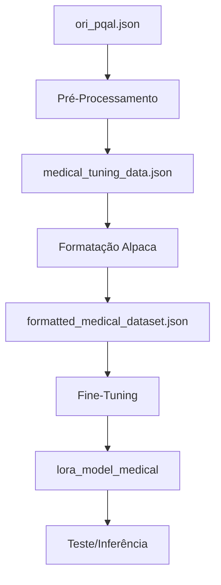

# 🏥 Fine-Tuning de Modelo LLM para Domínio Médico

Este diretório contém o pipeline completo de **pré-processamento e fine-tuning** de modelos LLM para tarefas de question-answering médico baseado em evidências científicas.

## 📖 Visão Geral

O pipeline completo transforma o dataset médico bruto (`ori_pqal.json`) do PubMedQA em um modelo LLM fine-tunado especializado em medicina, passando por:

1. **Pré-Processamento**: Anonimização, formatação e validação de dados
2. **Formatação Alpaca**: Conversão para formato padrão de fine-tuning
3. **Fine-Tuning**: Treinamento do modelo com LoRA (Low-Rank Adaptation)
4. **Inferência**: Teste e uso do modelo treinado

---

## 📁 Estrutura do Projeto

```
fine_tuning/
├── preprocessing/                    # Módulo de pré-processamento
│   ├── __init__.py
│   ├── data_processor.py            # Processamento de dados médicos
│   ├── validate_data.py             # Validação de dados processados
│   └── format_dataset.py            # Formatação para Alpaca
├── training/                        # Módulo de treinamento
│   ├── __init__.py
│   ├── finetuning_medical.py        # Script Python de fine-tuning
│   ├── finetuning_medical.ipynb     # Notebook de fine-tuning
│   └── model_config.py              # Configurações centralizadas
├── inference/                       # Módulo de inferência
│   └── test_model.py                # Teste do modelo treinado
├── utils/                           # Utilitários
│   ├── __init__.py
│   └── prompts.py                   # Templates de prompts
├── prepare-medical-data.ipynb       # Notebook de pré-processamento
├── run_pipeline.py                  # Pipeline completo
├── medical_tuning_data.json         # Dataset processado (gerado)
├── formatted_medical_dataset.json   # Dataset formatado Alpaca (gerado)
└── README.md                        # Este arquivo
```

---

## 🚀 Guia Rápido

### Pipeline Completo (Recomendado)

```bash
cd fine_tuning

# 1. Pré-processamento + Formatação
python run_pipeline.py --all

# 2. Fine-Tuning (escolha uma opção)
# Opção A: Notebook (recomendado para exploração)
jupyter notebook training/finetuning_medical.ipynb

# Opção B: Script Python
python training/finetuning_medical.py

# 3. Teste do Modelo
python inference/test_model.py --model_path lora_model_medical
```

---

## 📋 Parte 1: Pré-Processamento

### Objetivos

- ✅ **Anonimização** de dados sensíveis (conformidade LGPD/HIPAA)
- ✅ **Formatação** em estrutura de instrução para modelos LLM
- ✅ **Validação** de qualidade e integridade dos dados
- ✅ **Enriquecimento** com termos técnicos médicos (MESH)

### Pipeline de Pré-Processamento

O pipeline é composto por **6 etapas sequenciais**:

1. **Importação de Bibliotecas**: `json`, `re`, `Path`
2. **Carregamento do Dataset**: Lê `ori_pqal.json` do PubMedQA
3. **Anonimização**: Remove dados sensíveis (datas, IDs, telefones, emails)
4. **Formatação**: Transforma em formato de instrução com delimitadores
5. **Processamento Completo**: Aplica a todas as entradas
6. **Salvamento**: Gera `medical_tuning_data.json`

### Como Usar

#### Opção 1: Pipeline Completo

```bash
python run_pipeline.py --all
```

Executa: pré-processamento → validação → formatação Alpaca

#### Opção 2: Notebook Jupyter

```bash
jupyter notebook prepare-medical-data.ipynb
```

Execute as células sequencialmente.

#### Opção 3: Scripts Individuais

```bash
# Apenas pré-processamento
python preprocessing/data_processor.py

# Apenas validação
python preprocessing/validate_data.py

# Apenas formatação Alpaca
python preprocessing/format_dataset.py
```

### Formato dos Dados

**Entrada (ori_pqal.json):**
```json
{
  "21645374": {
    "QUESTION": "Do mitochondria play a role in remodelling plant leaves?",
    "CONTEXTS": ["Programmed cell death (PCD) is..."],
    "LONG_ANSWER": "Results depicted mitochondrial dynamics...",
    "MESHES": ["Mitochondria", "Apoptosis"]
  }
}
```

**Saída Intermediária (medical_tuning_data.json):**
```json
[
  {
    "id": "21645374",
    "input": "INSTRUÇÃO MÉDICA: ...\n[|Contexto|] ... [|eContexto|]\n[|Pergunta|] ... [|ePergunta|]\n[|Resposta|] ... [|eResposta|]"
  }
]
```

**Saída Final (formatted_medical_dataset.json):**
```json
{
  "instruction": ["Responda à pergunta baseando-se nos contextos..."],
  "input": ["Contexto: ...\nPergunta: ..."],
  "output": ["Results depicted mitochondrial dynamics..."]
}
```

---

## 🎯 Parte 2: Fine-Tuning

### Requisitos

- **GPU**: Mínimo 8GB VRAM (recomendado 16GB+)
- **CUDA**: Instalado e configurado
- **Bibliotecas**:
  ```bash
  pip install 'unsloth[colab-new] @ git+https://github.com/unslothai/unsloth.git'
  pip install --no-deps xformers "trl<0.9.0" peft accelerate bitsandbytes
  pip install transformers datasets
  ```

### Pipeline de Fine-Tuning

1. **Carregamento do Dataset**: Lê `formatted_medical_dataset.json`
2. **Carregamento do Modelo**: Modelo base pré-quantizado (Unsloth)
3. **Configuração LoRA**: Adiciona adaptadores LoRA ao modelo
4. **Formatação de Prompts**: Aplica template Alpaca médico
5. **Preparação do Dataset**: Formata todos os exemplos
6. **Configuração do Trainer**: SFTTrainer com hiperparâmetros
7. **Treinamento**: Executa fine-tuning
8. **Salvamento**: Salva adaptadores LoRA treinados
9. **Teste**: Valida qualidade do modelo

### Como Usar

#### Opção 1: Notebook Jupyter (Recomendado)

```bash
jupyter notebook training/finetuning_medical.ipynb
```

**Vantagens:**
- Visualização interativa de cada etapa
- Facilita debugging e ajustes
- Comentários detalhados em cada célula

**Ordem de execução:**
1. Execute as células sequencialmente (de cima para baixo)
2. Aguarde o treinamento (pode levar horas)
3. Verifique os resultados

#### Opção 2: Script Python

```bash
python training/finetuning_medical.py
```

**Vantagens:**
- Execução automatizada
- Melhor para produção
- Logs detalhados

### Configurações

As configurações estão centralizadas em `training/model_config.py`:

**Modelo:**
- Padrão: `unsloth/llama-3-8b-bnb-4bit`
- Outros disponíveis: Mistral, Phi-3, Gemma

**LoRA:**
- Rank: 16
- Alpha: 16
- Dropout: 0

**Treinamento:**
- Learning rate: 2e-4
- Max steps: 100
- Batch size: 2 (por dispositivo)
- Gradient accumulation: 4

**Ajustar configurações:**
Edite `training/model_config.py` antes de executar o fine-tuning.

### Hiperparâmetros Recomendados

| Parâmetro | Valor Recomendado | Descrição |
|-----------|-------------------|-----------|
| Learning Rate | 1e-4 a 5e-4 | Taxa de aprendizado |
| LoRA Rank | 8-64 | Capacidade do adaptador |
| Max Steps | 50-200 | Número de steps de treinamento |
| Batch Size | 2-8 | Depende da GPU |
| Gradient Accumulation | 4-16 | Simula batch maior |

---

## 🧪 Parte 3: Teste e Inferência

### Testar Modelo Treinado

```bash
# Modo exemplos (testa com exemplos pré-definidos)
python inference/test_model.py --model_path lora_model_medical --mode examples

# Modo interativo (perguntas customizadas)
python inference/test_model.py --model_path lora_model_medical --mode interactive
```

### Exemplo de Uso Programático

```python
from unsloth import FastLanguageModel
from utils.prompts import get_medical_alpaca_prompt, get_instruction_only

# Carrega modelo
model, tokenizer = FastLanguageModel.from_pretrained(
    model_name="lora_model_medical",
    max_seq_length=2048,
    load_in_4bit=True,
)
FastLanguageModel.for_inference(model)

# Prepara prompt
instruction = get_instruction_only()
input_text = "Contexto: ...\nPergunta: Qual o tratamento para hipertensão?"
prompt = get_medical_alpaca_prompt(instruction, input_text, "")

# Gera resposta
inputs = tokenizer([prompt], return_tensors="pt").to("cuda")
outputs = model.generate(**inputs, max_new_tokens=256)
response = tokenizer.batch_decode(outputs)[0]
```

---

## 📊 Formato Alpaca para Fine-Tuning

O formato Alpaca é o padrão usado para fine-tuning de modelos LLM:

```
Below is a medical instruction that describes a task, paired with medical context and a question. Write a response that appropriately completes the request based on the provided medical evidence.

### Instruction:
{instrução}

### Input:
{contexto + pergunta}

### Response:
{resposta esperada}
```

**Por que Alpaca?**
- ✅ Padrão amplamente adotado
- ✅ Compatível com modelos pré-treinados (LLaMA, Mistral, etc.)
- ✅ Estrutura clara para o modelo entender a tarefa
- ✅ Suportado por bibliotecas (Unsloth, TRL, Hugging Face)

---

## 🔒 Anonimização de Dados

### Padrões Identificados e Substituídos

| Padrão Original | Placeholder | Exemplo |
|----------------|-------------|---------|
| Datas (DD/MM/YYYY) | `[DATA]` | `15/03/2024` → `[DATA]` |
| Datas (YYYY-MM-DD) | `[DATA]` | `2024-03-15` → `[DATA]` |
| IDs de pacientes | `[PACIENTE_ID]` | `ID: 12345` → `ID: [PACIENTE_ID]` |
| Telefones | `[TELEFONE]` | `11987654321` → `[TELEFONE]` |
| Emails | `[EMAIL]` | `email@hospital.com` → `[EMAIL]` |

### Conformidade Legal

- ✅ **LGPD** (Lei Geral de Proteção de Dados - Brasil)
- ✅ **HIPAA** (Health Insurance Portability and Accountability Act - EUA)
- ✅ Proteção de dados pessoais de pacientes
- ✅ Prevenção de vazamento de informações sensíveis

---

## 📈 Estatísticas e Performance

### Tempo de Processamento

**Pré-Processamento:**
- Dataset pequeno (< 1.000 entradas): ~30 segundos
- Dataset médio (1.000 - 10.000 entradas): ~2-5 minutos
- Dataset grande (> 10.000 entradas): ~10-30 minutos

**Fine-Tuning:**
- Depende do tamanho do dataset e GPU
- Com LoRA: ~1-4 horas (GPU moderna)
- Sem LoRA: ~8-24 horas (requer muito mais memória)

### Uso de Memória

**Pré-Processamento:**
- Mínimo: 4GB RAM
- Recomendado: 8GB+ RAM

**Fine-Tuning:**
- Com LoRA + 4-bit: 8-16GB VRAM
- Sem LoRA: 40GB+ VRAM (modelos grandes)

### Taxa de Sucesso

- Pré-processamento: > 99% de entradas processadas
- Fine-tuning: Depende da qualidade dos dados e configurações

---

## 🐛 Troubleshooting

### Pré-Processamento

**Erro: Arquivo não encontrado**
```
Solução: Verifique o caminho em run_pipeline.py ou ajuste manualmente
```

**Erro: Memória insuficiente**
```
Solução: Processe em lotes ou aumente RAM disponível
```

### Fine-Tuning

**Erro: CUDA out of memory**
```
Solução:
1. Reduza batch_size em model_config.py
2. Aumente gradient_accumulation_steps
3. Use modelo menor
4. Reduza max_seq_length
```

**Erro: Dataset não encontrado**
```
Solução: Execute primeiro python run_pipeline.py --all
```

**Erro: Import unsloth failed**
```
Solução: Instale dependências:
pip install 'unsloth[colab-new] @ git+https://github.com/unslothai/unsloth.git'
```

**Loss não diminui**
```
Solução:
1. Verifique qualidade dos dados
2. Ajuste learning rate
3. Aumente número de steps
4. Verifique se dataset está formatado corretamente
```

### Inferência

**Erro: Modelo não encontrado**
```
Solução: Verifique caminho do modelo treinado
```

**Respostas de baixa qualidade**
```
Solução:
1. Treine por mais steps
2. Ajuste hiperparâmetros
3. Verifique qualidade do dataset
4. Use modelo base maior
```

---

## 📚 Referências e Recursos

### Datasets

- **PubMedQA**: Dataset de perguntas e respostas médicas baseadas em evidências
- Localização: `../context/pubmedqa-master/data/ori_pqal.json`
- Paper: [PubMedQA: A Dataset for Biomedical Research Question Answering](https://arxiv.org/abs/1909.06146)

### Bibliotecas

- **Unsloth**: Fine-tuning rápido e eficiente
  - GitHub: https://github.com/unslothai/unsloth
- **Hugging Face Transformers**: Modelos de linguagem
  - Docs: https://huggingface.co/docs/transformers
- **TRL**: Training Reinforcement Learning
  - Docs: https://huggingface.co/docs/trl

### Documentação Técnica

- **Instruction Tuning**: Técnica de fine-tuning para modelos LLM
- **LoRA**: Low-Rank Adaptation para fine-tuning eficiente
- **Alpaca Format**: Formato padrão de instrução
- **LGPD**: Lei Geral de Proteção de Dados (Brasil)
- **HIPAA**: Health Insurance Portability and Accountability Act (EUA)
- **MESH**: Medical Subject Headings (vocabulário controlado)

---

## 🔄 Fluxo Completo do Pipeline



### Passo a Passo Detalhado

1. **Pré-Processamento**
   ```bash
   python run_pipeline.py --preprocess
   ```
   - Carrega `ori_pqal.json`
   - Anonimiza dados sensíveis
   - Formata com delimitadores
   - Gera `medical_tuning_data.json`

2. **Formatação Alpaca**
   ```bash
   python run_pipeline.py --format
   ```
   - Converte para formato Alpaca
   - Separa instruction, input, output
   - Gera `formatted_medical_dataset.json`

3. **Fine-Tuning**
   ```bash
   python training/finetuning_medical.py
   ```
   - Carrega modelo base
   - Configura LoRA
   - Treina com dados médicos
   - Salva adaptadores LoRA

4. **Teste**
   ```bash
   python inference/test_model.py
   ```
   - Carrega modelo treinado
   - Testa com exemplos
   - Valida qualidade

---

## 📞 Suporte

Para dúvidas ou problemas:

1. Verifique a seção **Troubleshooting** acima
2. Revise os comentários detalhados nos notebooks
3. Execute scripts de validação para diagnosticar problemas
4. Verifique os logs de processamento/treinamento

---

## 📄 Licença

Este código faz parte do projeto Medical Assistant e segue as mesmas diretrizes de licenciamento do projeto principal.

---

**Última atualização:** 2024

**Versão do pipeline:** 2.0 (com fine-tuning)
